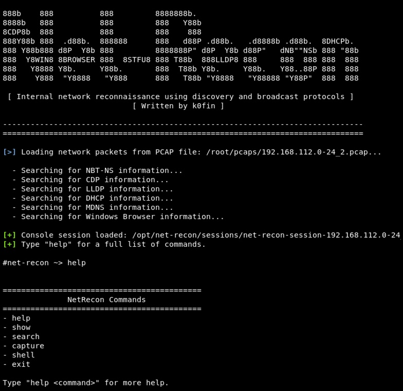

# Net-Recon

## About

* Net-Recon is a tool written to perform information gathering on internal networks.
* Since net-recon utilizes host-discovery and broadcast-related protocols, information which may be valuable to an attacker
  can be obtained without ever actively scanning or querying a host.

* This tool does not parse or search for network-based credentials.
* If you wish to parse a PCAP for secrets, be sure to check out the super awesome net-creds (https://github.com/DanMcInerney/net-creds)

## Supported Protocols and Data Types

* Link Local Discovery Protocol
  - Network switch system names
  - Network switch system fingerprints
  - Network switch management addresses
  - TR-41 Commitee Location Identification

* Microsoft Windows Browser Protocol (Host, Domain/Workgroup, and Local Master Browser Announcements)
  - Hostnames
  - Windows OS Version
  - Server Type
  - Host Comment (reveals potentially sensitive information / service fingerprints)

* DHCPv4 Bootstrap
  - DHCP Server IP Address
  - Router IP Address
  - Domain Name Server Addresses
  - Hostnames

* Cisco Discovery Protocol
  - CDP Checksum
  - CDP Device Name / ID
  - CDP Device ID Type
  - CDP Version

* MDNS
  - Internal domain names
  - Lookup types

* NetBIOS Name Service
  - NetBIOS names
  - Source MAC and IPv4 Addresses
  - NBNS Transaction ID's

## Protocols and Data Types Currently In Progress

* SMB Session Setup AndX Response
* Kerberos
* HTTP/WPAD

## Usage

* Perform a packet capture to a PCAP file using a tool like tcpdump.

    tcpdump -i <iface> -w <pcap_outfile_path>

* Then, use net-recon to analyze the PCAP file for info.

    ./net-recon.py --pcap <pcap_file_path>
